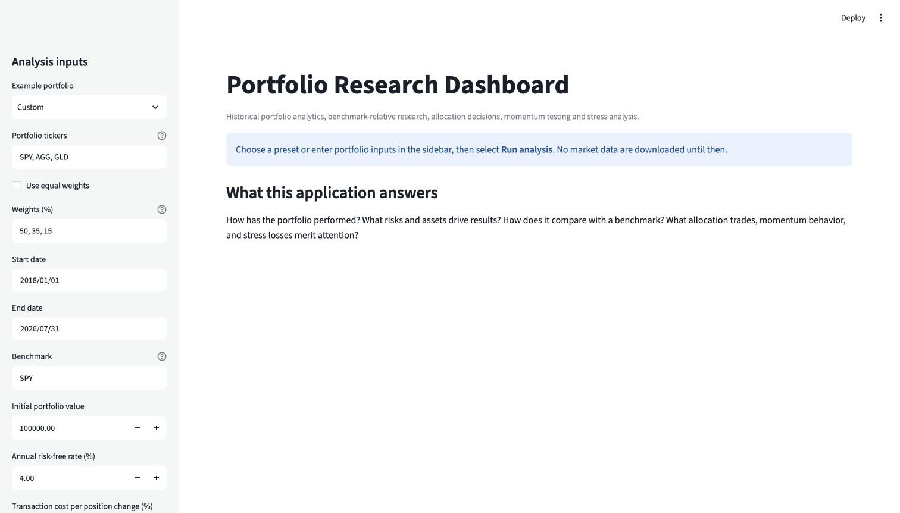
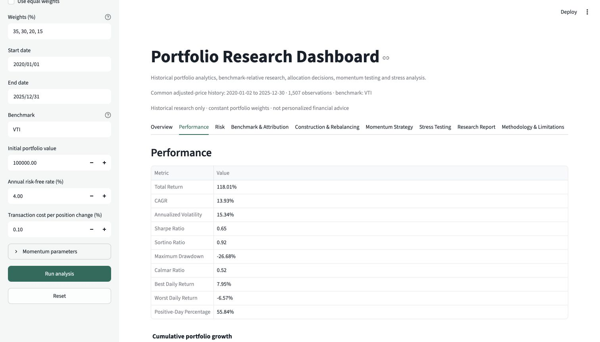
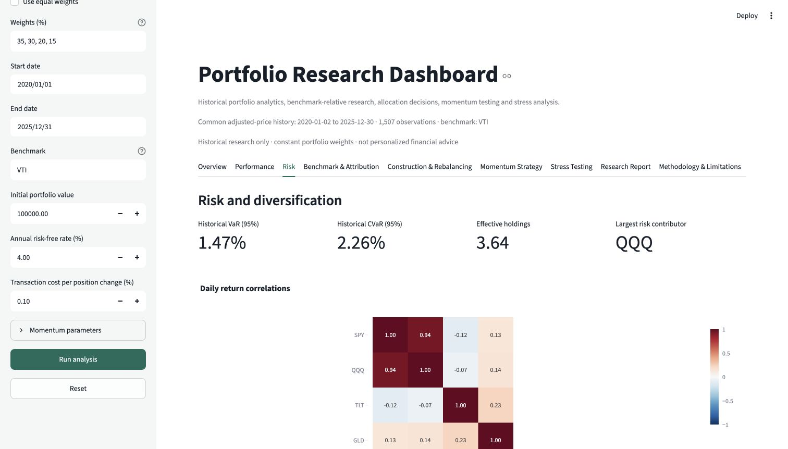
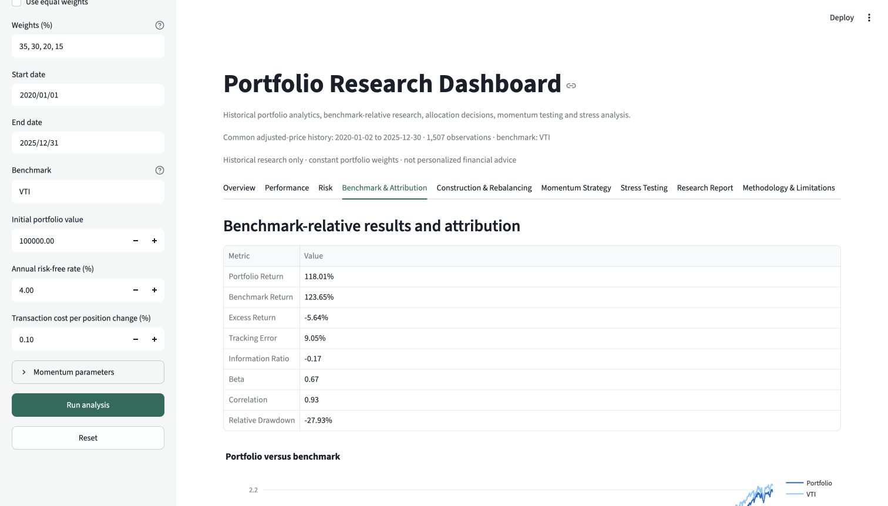
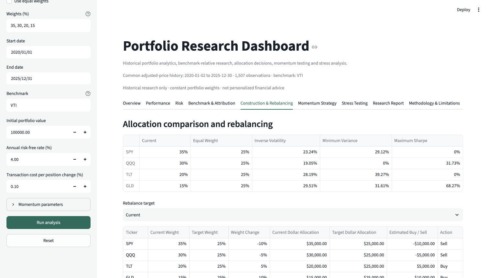
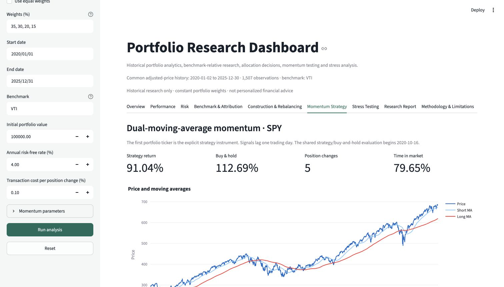
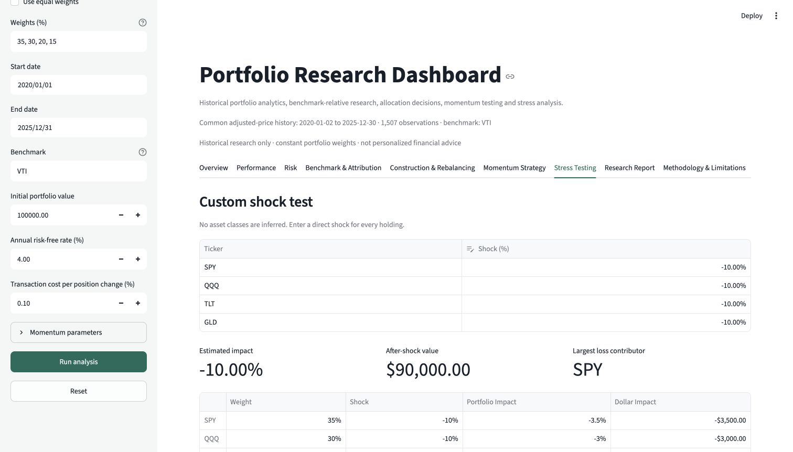
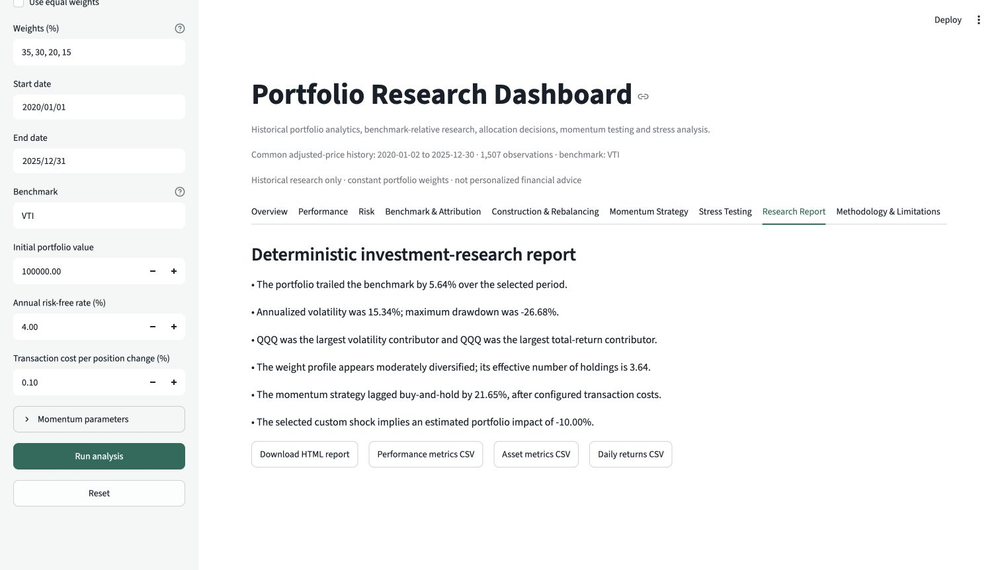

# Portfolio Research Dashboard

**From portfolio inputs to an auditable investment-research report.**

A focused, internship-ready Streamlit application for historical portfolio research. It turns a ticker-and-weight input into a reproducible view of performance, market risk, benchmark-relative results, attribution, allocation alternatives, rebalancing trades, a lagged momentum backtest, stress tests, and a downloadable HTML research report.

The project is intentionally small enough to explain in an interview: market data enter through one validated boundary, financial calculations are pure functions, the UI only orchestrates those functions, and core formulas and reconciliation rules are covered by deterministic local tests.

> **Deployment status:** the repository is Community Cloud-ready. A public hosted URL will be added only after the deployment has been opened and verified in a signed-out browser.

## Why this project matters

This application demonstrates:

- portfolio analytics
- market-risk measurement
- benchmark-relative evaluation
- portfolio construction
- rebalancing decisions
- systematic strategy research
- financial-data engineering
- investment-research communication

## Features

- Comma-separated ticker validation, equal/custom weights, presets, date range, benchmark, capital, risk-free rate and transaction-cost controls
- Adjusted yfinance history with caching, safe single/MultiIndex handling, strict failed-ticker reporting and complete-common-date alignment
- Total return, CAGR, volatility, Sharpe, Sortino, drawdown, Calmar, tail risk, monthly returns and wealth charts
- Beta, correlation, covariance, VaR/CVaR, concentration, effective holdings, and reconciled return/volatility attribution
- Benchmark excess return, tracking error, information ratio, relative drawdown and relative wealth
- Current, equal-weight, inverse-volatility, minimum-variance and maximum-Sharpe long-only allocations
- Dollar rebalancing plan with intuitive buy/sell signs and CSV export
- Dual-moving-average long/cash strategy on the first requested holding, with one-day signal lag and transaction costs
- Editable per-asset custom shocks and complete historical stress windows
- Rules-based summary, six CSV exports and a self-contained HTML research report

## Architecture

```text
app.py                              Streamlit controls, navigation and charts
portfolio_dashboard/
  config.py                         conventions, presets, historical windows
  data.py                           inputs, yfinance parsing, missing-data policy
  performance.py                    returns and performance metrics
  risk.py                           benchmark metrics and attribution
  construction.py                   allocation methods and SLSQP optimizers
  rebalancing.py                    target trade plan
  strategy.py                       lagged momentum backtest
  stress.py                         custom and historical stress tests
  reporting.py                      deterministic narrative and HTML export
  pipeline.py                       reusable end-to-end analytics pipeline
  formatting.py                     shared UI and report number formats
tests/test_analytics.py             synthetic financial unit and integration tests
tests/test_app.py                   offline Streamlit entrypoint smoke tests
docs/METHODOLOGY.md                 formulas, assumptions and limitations
docs/ARCHITECTURE.md                living system and module reference
docs/PROJECT_HISTORY.md             evidence-backed project milestones
docs/PROJECT_JOURNAL.md             chronological engineering narrative
docs/DECISIONS.md                   product and methodology decisions
docs/ROADMAP.md                     completed, planned, deferred and avoided work
docs/DEPLOYMENT.md                  Community Cloud setup and verification checklist
docs/DEMO_GUIDE.md                  two- and five-minute interview demonstrations
docs/SHOWCASE_REVIEW.md             final visual and functional review record
docs/images/                        reproducible application screenshot gallery
CHANGELOG.md                        user-facing milestone changes
```

For module ownership, dependencies, state, and end-to-end diagrams, see [docs/ARCHITECTURE.md](docs/ARCHITECTURE.md).

## Screenshot gallery

All captures use the documented four-ETF sample portfolio. Displayed market results are historical examples, not expected returns.

| Landing and workflow | Performance |
|---|---|
|  |  |
| Risk and correlation | Benchmark and attribution |
|  |  |
| Construction and rebalancing | Momentum strategy |
|  |  |
| Stress testing | Research report |
|  |  |

## Installation and local execution

Python 3.11 or 3.12 is recommended.

```bash
python3.11 -m venv .venv
source .venv/bin/activate
python -m pip install -r requirements.txt
streamlit run app.py
```

Open the local URL Streamlit prints. Select a preset, adjust inputs if desired, and click **Run analysis**. Internet access is needed only when the app downloads market history; tests are offline.

## Testing

```bash
.venv/bin/pytest -q
.venv/bin/python -m compileall app.py portfolio_dashboard tests
```

Tests cover validation, data layout/missingness, returns, portfolio aggregation, CAGR, volatility, Sharpe, Sortino, drawdown, VaR/CVaR, beta, tracking error, information ratio, risk-contribution reconciliation, allocation failure handling, rebalancing, signal lag, costs, stress tests, report units, the integrated analytics pipeline, and the offline Streamlit entrypoint.

## Streamlit Community Cloud deployment

1. Push this repository to GitHub.
2. In Streamlit Community Cloud, create an app from the repository.
3. Set the entrypoint to `app.py` and choose Python 3.11 if the runtime selector is available.
4. Deploy. No secrets, database, paid API, system packages, or local paths are required.

The app downloads data only after the user clicks **Run analysis**. `requirements.txt` uses bounded versions compatible with Community Cloud; Streamlit 1.55 or newer is required for state-aware, lazily rendered tabs.

Follow the complete [deployment and post-deployment checklist](docs/DEPLOYMENT.md). Do not describe the app as deployed until its public URL passes that signed-out verification.

## Methodology and assumptions

Daily simple returns and 252 trading days are used consistently. Holdings use constant weights for historical portfolio returns. The benchmark is downloaded separately and aligned on common dates. Historical VaR/CVaR use the empirical lower tail. Risk contribution uses Euler decomposition. Optimization is long-only and uses historical sample means/covariances. The momentum signal uses short and long simple moving averages, is shifted by one full period, and pays proportional costs whenever position changes. See [docs/METHODOLOGY.md](docs/METHODOLOGY.md).

## Limitations and disclaimer

yfinance data can be delayed, revised, incomplete, or temporarily unavailable. Common-date alignment can shorten history. Historical estimates and optimized weights are not forecasts. Results exclude taxes, liquidity constraints, market impact, and slippage beyond the configured cost, and do not model live execution. Historical stress windows are shown only when fully covered.

For research and educational use only. This application does not provide personalized financial advice.

## Project Story

**Context from current development session — verify before treating as canonical.**

This focused dashboard was created to demonstrate an end-to-end portfolio-research workflow that is easy to use, test, deploy, and explain in an internship interview. It connects portfolio analytics, market-risk measurement, benchmark-relative investment research, allocation and rebalancing decisions, and one transparent systematic strategy without becoming a collection of unrelated institutional features.

Clarity and financial correctness were prioritized over breadth. That choice led to explicit missing-data handling, reconciled contribution formulas, long-only optimization checks, one-period strategy lag, deterministic reporting, and synthetic offline tests. Advanced machine learning, automatic strategy tuning, live execution, personalized advice, and fragile report tooling were deferred or avoided because their data and model risks would weaken this project’s central story.

University materials reviewed during the current development session informed the roadmap around performance measurement, single-index benchmark research, rebalancing, transaction costs, warm-up periods, and overfitting controls. Course code and formulas were not copied or treated as verified implementation evidence.

The project is separate from the frozen Portfolio Intelligence Platform. That platform was not inspected or modified during this showcase phase, and no claim is made here about its internal architecture. This repository intentionally remains the smaller, focused, interview-ready application.

## Interview-ready explanation

“I built a modular Streamlit research dashboard that validates and aligns adjusted market data, computes portfolio and benchmark-relative analytics, decomposes risk using Euler contributions, compares explainable long-only allocations, produces a self-financing rebalance plan, and backtests a one-day-lagged momentum rule with costs. I separated calculations from presentation and tested the main pipeline entirely with synthetic data, so the financial logic is reproducible without network access.”

Use [docs/DEMO_GUIDE.md](docs/DEMO_GUIDE.md) for a timed walkthrough and interview questions.

## Suggested next improvement

Add an optional user-uploaded local price CSV path using the same validation boundary. That would improve reproducibility and demos during yfinance outages without adding a database or changing the analytical model.

## Development and documentation rules

- Every material feature or methodology change must update the relevant [project history](docs/PROJECT_HISTORY.md), [decision log](docs/DECISIONS.md), [roadmap](docs/ROADMAP.md), [changelog](CHANGELOG.md), or [methodology guide](docs/METHODOLOGY.md).
- Material feature changes must update the [project journal](docs/PROJECT_JOURNAL.md) when they affect product direction, important tradeoffs, or engineering lessons.
- Architectural changes must update the living [architecture reference](docs/ARCHITECTURE.md).
- Commit messages should explain the intent of a change, not merely list changed files.
- Every financial-formula change must include deterministic tests and a methodology update.
- Course-derived additions must identify the relevant course source and must be independently implemented and verified; course code is not assumed correct.
- Decisions must not be reconstructed from memory when repository evidence is unavailable. Label development-session context explicitly until it is independently confirmed.
- Codex or any coding agent must inspect the documentation system and current code before making a major change.
