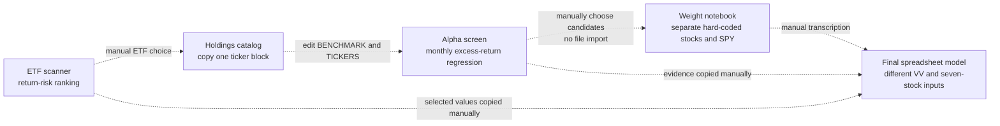

# Portfolio Management Final Assignment — ETF Screening, Alpha Selection, and Portfolio Optimization

This internal evidence record documents the five source artifacts reviewed on 2026-08-02. The originals were read in place and were not modified. Public PortfolioLens surfaces use professional terminology only.

## Source inventory

| Source | Exact path | Type / size / modified | Role, inputs and outputs | Dependencies and failure modes |
|---|---|---|---|---|
| Final model | `Assignment/Portfolio_Management_Final_Assignment_Jameel_Shaikh.xlsx` | XLSX; 630,732 bytes; 2026-05-25 02:18:03 EDT | Seven-sheet presentation and calculation model; formulas consume embedded price/return data and manual assumptions rather than the four named code outputs directly. | 94 defined names, including saved Solver names and stale template names; four external-link parts; no VBA, connections or embedded executables. Broken/stale links and inconsistent hard-coded rates can make cached and recalculated results differ. |
| ETF scanner | `Assignment/etf_scanner.py` | Python; 21,377 bytes; 2026-05-11 11:58:06 EDT | Downloads five years of monthly Yahoo Finance data for hard-coded equity and bond ETF universes; writes four sheets to a local Downloads folder. No CLI. | `yfinance`, `pandas`, `numpy`, `openpyxl`; live network, mutable end date, Yahoo metadata, absolute output path and hard-coded bond characteristics. Empty downloads, insufficient observations and rate limits can reduce or stop results. |
| Holdings catalog | `Assignment/etf_holdings.py` | Python; 23,207 bytes; 2026-04-19 20:19:48 EDT | Manual paste catalog of 28 ETF benchmark/ticker blocks. It has no extraction, weights, dates, functions, imports or output. Executing it leaves only the final VYM assignment in memory. | Standalone data literal. The header says 29 ETFs although 28 blocks are present. Missing weights, cash, derivatives, source dates and ticker normalization prevent production look-through. |
| Weight notebook | `Assignment/stock_weights_optimizer.ipynb` | Jupyter notebook; 22,654 bytes; 2026-04-22 23:57:09 EDT | Thirteen top-to-bottom cells (one Markdown, twelve code), all unexecuted with no stored outputs. Downloads five hard-coded stocks plus SPY, estimates a single-index model, forms normalized alpha/residual-variance weights, calculates a constrained complete allocation, charts and exports `stock_weights.csv` and `portfolio_weights.png`. | `numpy`, `pandas`, `yfinance`, `matplotlib`, `scipy`; live prices and P/E values; sequential hidden state; no parameter file; no alpha-screen CSV input. A CAPM-alpha branch mixes excess and total-return units, and the risk chart stacks volatilities rather than reconciling variances. |
| Alpha screen | `Assignment/alpha_screen_short.py` | Python; 15,502 bytes; 2026-04-23 01:15:18 EDT | Downloads monthly prices for a manually edited benchmark and ticker list; screens positive annualized regression intercepts using an approximate p-value and current positive EPS/P-E/analyst-target fields; writes `xli_alpha_fundamentals.csv` in the current directory. No CLI. | `yfinance`, `pandas`, `numpy`; live mutable data and fundamentals, hard-coded 4.32% risk-free rate and five-year window. The filename is stale relative to the ESGU benchmark; Yahoo ticker normalization is absent; current analyst data mixed with historical regression creates as-of and look-ahead concerns. |

## Actual data flow

The source files therefore express a research sequence, but they are **not an executable pipeline**. No named file imports another. Schemas are not contracted, ticker/date conventions are not centralized, and the notebook does not consume `xli_alpha_fundamentals.csv`. The workbook uses VV and seven active stocks, while the notebook uses SPY and five mega-cap stocks. Every connection is a manual selection, code edit, or transcription step.

## Workbook worksheet inventory

All seven sheets are visible and nonempty; no materially hidden rows or columns were found.

| Worksheet | Purpose and substantive methodology | Inputs / outputs / charts | Recoverable Solver state and limitations |
|---|---|---|---|
| Capital Allocation | Combines a risk-free asset with the selected risky portfolio. `y=(E[risky]-rf)/(Aσ²)`, complete return `rf+y(E[risky]-rf)`, volatility `yσ`, utility `E[r]-0.5Aσ²`. | 4.32% risk-free rate, risk score 61 mapped manually to `A=25(1-score/100)=9.75`; 24 formulas, three charts and two images. Saved result allocates about 61.56% to risky assets. | Objective `D18`, changing cell `D11`; saved constraint names indicate `D11<=1` and `D11>=0`. The risk-score-to-aversion mapping is a model choice, not inferred investor advice. |
| Asset Classes Allocation | Two-asset bond/equity mean-variance model: `w'μ`, `w'Σw`, covariance from correlation, Sharpe and a complete allocation. | AGG and equity inputs; 55 formulas and two charts. Equity return comes from Security Allocation; bond “expected return” is a -100 bp duration/convexity price scenario. | Objective `E24`, changing `B24`, constraints `0<=B24<=1`. Saved solution is essentially all equity for maximum Sharpe. Treating a rate-shock price effect as expected return is not preserved in PortfolioLens. |
| Security Allocation | Single-index/Treynor–Black-style selection for VV plus STRL, FIX, VST, ANET, HWM, EME and LLY. Adjusted alpha scales raw alpha by a P/E ratio; preliminary active weights use `alpha/residual variance`; portfolio moments use index-model covariance. | 317 formulas and one chart; active weights, risk decomposition and CAPM/Treynor/Sharpe/Information-style outputs. | Objective `C63`, changing `E59:J59`; saved bounds are recoverable from Solver names. The final active/passive mix is 100% active, but a complete Treynor–Black derivation is not recoverable and several displayed labels are nonstandard. |
| Data. Securities | Embedded monthly price/return history, market and security summary statistics, regression inputs and fundamental fields used elsewhere. | 2,408 formulas, three charts, two images; simple monthly returns, arithmetic/sample statistics and correlations. | External links and cached values make exact as-of reproduction unsafe; price-provider retrieval is not linked to the named scripts. |
| Data. Bond Duration & Convexity | AGG cash-flow, modified-duration and convexity calculations plus a -100 bp rate scenario. | 14 formulas and one image. Uses coupon 3.7%, YTM 4.31%, maturity 8.05 years and effective duration 5.79. | The price-effect formula uses supplied effective duration while convexity is derived from Excel `MDURATION`, so the assumptions are internally mixed. |
| TB Attribution | Repeats active/passive weights and performance attribution. | 54 formulas; alpha, beta, residual variance and performance ratios. | “Active information ratio” is alpha/residual variance rather than the standard appraisal or information ratio. |
| Research Evidence | Formula checks, source notes and narrative claims. | 108 formulas; no charts. | Several narrative values are stale relative to live formulas; the displayed pass logic omits the stated p-value test, and 4.32%/5% risk-free assumptions coexist. |

The workbook contains 4,519 nonempty cells, 2,980 formulas, nine native charts and eleven media objects. Four external-link parts and template residue are present; no macro, add-in binary or Excel data connection is embedded. Saved Solver names recover objective/changing cells and long-only bounds, but not a trustworthy record of every historical run or manual override.

## Implemented investment logic and limitations

- **Universe construction:** hard-coded ESG, sector, thematic and bond lists. Equity selection requires at least 59 monthly observations, arithmetic total return above the 4.32% annual risk-free rate, Sharpe at least 0.50 and volatility at most 25%. It does not actually impose equity AUM, volume or expense-ratio filters.
- **Bond ranking:** a min-max composite of yield 30%, duration 25%, convexity 20%, Sharpe 15% and inverse volatility 10%. Yield/duration/convexity include hard-coded fallback values without a stored source date; this is not implemented as a live PortfolioLens rank.
- **Holdings:** manual ticker membership only; there is no holding weight, overlap, cash/derivative or staleness model in the source.
- **Alpha screen:** monthly simple excess returns with `Ri-rf = alpha + beta(Rm-rf)+epsilon`; alpha is the monthly intercept times 12. The source p-value is an approximation rather than an exact Student-t test. Positive current EPS, P/E and analyst target return are additional gates.
- **Weighting:** the notebook normalizes selected `alpha/residual variance` scores to long-only weights, but does not implement a complete active/passive Treynor–Black portfolio. Its complete allocation uses `y=(E[r]-rf)/(A variance)` constrained to 0–100%.
- **Costs and evaluation:** no turnover, transaction costs, walk-forward evaluation or rebalancing rule connects the five files. Performance is in-sample.

## PortfolioLens traceability

| Source / area | Concept | PortfolioLens equivalent | Status / difference | Tests and decision |
|---|---|---|---|---|
| `etf_scanner.py` / `compute_metrics` | Historical arithmetic return, sample volatility, Sharpe, total return, drawdown and explicit screens | `portfolio_dashboard.etf_research.etf_research_metrics` and `filter_etf_research`; ETF Research tab | Implemented professionally on the user-selected aligned universe. Daily frequency and 252-day annualization follow PortfolioLens; thresholds are editable. Hard-coded bond metadata/composite is excluded. | `tests/test_etf_research.py::test_etf_metrics_and_explicit_filter_rules` |
| `etf_holdings.py` | ETF constituent membership | `normalize_holdings`, `holdings_coverage`, `consolidated_security_exposure`, `etf_overlap`; user CSV workflow | Source catalog is not a holdings extractor. PortfolioLens requires explicit disclosed weights and does not infer missing cash, derivatives or dates. | Duplicate, malformed schema, coverage, exposure and overlap tests. |
| `alpha_screen_short.py` / `ols_alpha` | Excess-return alpha/beta/R² and significance screen | Existing exact single-index diagnostics plus `rank_security_candidates` | Implemented differently: aligned daily returns, exact t distribution and transparent observation/p-value/alpha gates; current analyst-target fundamentals are excluded. | Existing regression recovery tests plus ranking and zero-residual tests. |
| Notebook regression/weights | Alpha/residual-risk active weights and complete allocation | Security Analysis diagnostics; long-only Portfolio Optimization; utility-based complete portfolio | Partial / educational-only. The source’s normalized active weights and incomplete Treynor–Black mix are not presented as production construction. | Existing regression, optimizer and complete-allocation tests. |
| Final spreadsheet Solver areas | Long-only capital, asset-class and security allocation | Portfolio Optimization and Asset Allocation workspaces | Implemented differently with consistent arithmetic expected returns, sample covariance, explicit constraints and solver diagnostics. Rate-shock-as-expected-return and inconsistent rate assumptions are not copied. | Existing construction, constraint and AppTest suites. |
| Entire manual chain | Repeatable pipeline and exports | ETF Research downloads plus existing Security Analysis and Portfolio Optimization exports | Partially implemented as modular research stages, not a single automatic recommender. No live broad-universe scan or holdings scrape is claimed. | Unit tests, offline AppTest and synthetic integration verification. |

## Product classification

- **Course-derived:** transparent return/risk screening, excess-return security diagnostics, candidate ranking criteria, long-only construction concepts.
- **Professional enhancements:** weighted holdings look-through, disclosed-weight coverage, pairwise constituent/weight overlap, centralized schema validation and explicit exports.
- **Engineering improvements:** pure functions, no execution on import, no absolute paths, fixed-data tests, actionable validation errors and separation of download from analytics.
- **Advanced ideas deferred:** live ETF universe service, authoritative dated holdings ingestion, issuer/sector concentration, alpha confidence robustness, turnover-penalized or benchmark-aware optimization and walk-forward evaluation. These require governed data and additional methodology validation.
- **Intentionally excluded:** analyst-target-return gates, stale hard-coded bond scores, automatic trade labels, incomplete Treynor–Black active/passive allocation, the notebook’s inconsistent CAPM-alpha branch and stacked-volatility risk chart.
