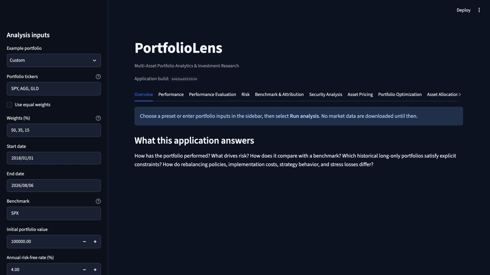
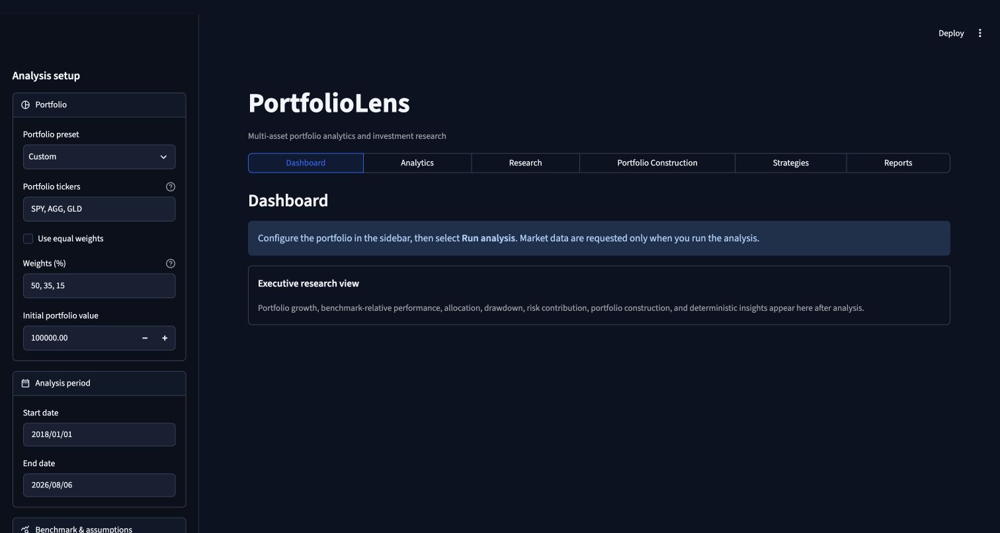
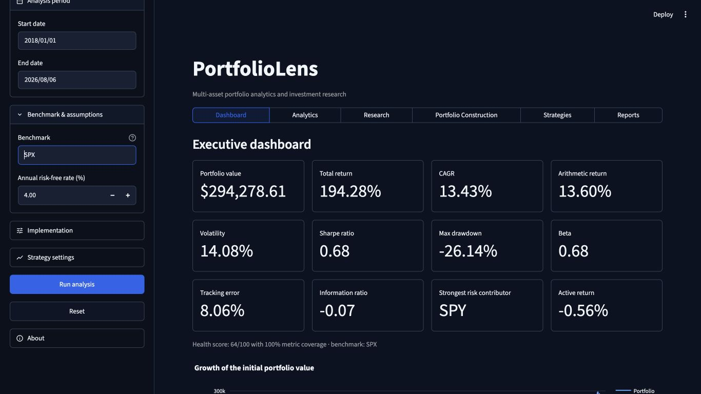
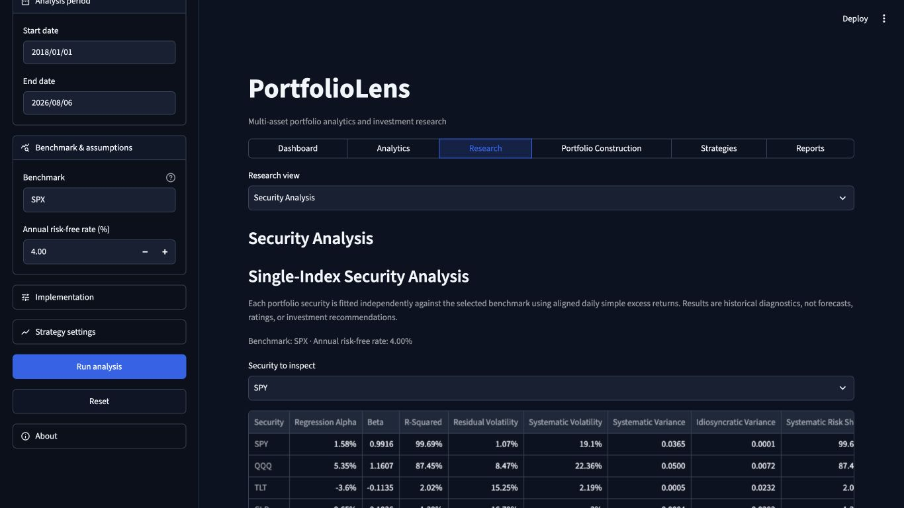

# PortfolioLens UX audit

Audit date: 2026-08-06

Viewport: 1366 × 768

Sample: SPY / QQQ / TLT / GLD at 40% / 25% / 20% / 15%, benchmark SPX

## Audit scope

This audit covered the product shell, global analysis setup, all navigation destinations, the executive dashboard, representative analytical/research/construction/report views, and report/download reachability. Evidence combines current-run screenshots, Streamlit AppTest, deterministic offline data, source inspection, and a complete local four-ETF workflow. Screenshot review can identify visible hierarchy and responsive risks; it does not establish complete keyboard or assistive-technology conformance.

## Before

The initial view exposed 15 peer tabs. At laptop width, only the first nine were visible and Streamlit rendered a “scroll tabs right” control, leaving Strategies, Stress Testing, Reports, ETF Research, and Methodology outside immediate view. The build hash occupied main-header space. Ten global and strategy controls formed one long sidebar list. Overview showed only seven cards, one growth chart, and a weights table after analysis, so it did not function as an executive dashboard.

## After

Six primary workspaces fit in one row at 1366 pixels. Related sections are exposed through one compact secondary selector. Portfolio, analysis period, and benchmark assumptions remain open; implementation and strategy settings are collapsed; Run analysis and Reset remain persistent. Build metadata moved to About and Methodology.

The Dashboard now leads with 12 decision-relevant metrics in three four-card rows and follows with portfolio-versus-benchmark growth, drawdown, allocation, risk contribution, an efficient-frontier preview, and deterministic insights.

Research keeps one stable primary destination while the secondary selector exposes Security Analysis, Asset Pricing, and ETF Research. The selected security control appears before the comparison output, and the visible comparison is intentionally concise; the complete diagnostic table remains in an expander and export.

## Findings and disposition

| # | Finding | Evidence | Disposition |
|---|---|---|---|
| 1 | Primary navigation overflow hid major features. | Before screenshot; visible tab-scroll control. | Replaced with six primary workspaces. |
| 2 | Related analysis was separated into peer tabs. | Former tab registry and before screenshot. | Regrouped by research task; exact mapping below. |
| 3 | Header metadata weakened hierarchy. | Build hash appeared directly below subtitle. | Moved to About and Methodology. |
| 4 | Sidebar scanning cost was high. | Ten controls in one uninterrupted list. | Grouped controls with progressive disclosure. |
| 5 | Overview was not an executive dashboard. | Seven cards, growth chart, weights table only. | Added benchmark, risk, allocation, frontier, and insight evidence. |
| 6 | Reports and ETF tools were hard to discover. | They appeared beyond the visible tab rail. | Placed under visible Reports and Research workspaces. |
| 7 | Long explanations competed with outputs. | Pre-analysis pages contained feature inventories. | Replaced with a concise run prompt; detailed explanations remain in captions/expanders. |
| 8 | Navigation changes risked losing analysis state. | Streamlit widget identity changes across views. | Retained results in session state and added a legacy-section compatibility bridge plus AppTest. |
| 9 | Failed runs could expose stale research if clearing regressed. | State owner is shared across all views. | Preserved clear-before-validate behavior and its regression test. |
| 10 | Some view code is overloaded in one file. | `app.py` owns all view rendering. | Documented as a remaining maintainability limitation; no finance refactor in this task. |

## Exact old-to-new mapping

| Former top-level section | New primary workspace | New view |
|---|---|---|
| Overview | Dashboard | Dashboard |
| Performance | Analytics | Performance |
| Performance Evaluation | Analytics | Performance Evaluation |
| Risk | Analytics | Risk |
| Benchmark & Attribution | Analytics | Benchmark & Attribution |
| Stress Testing | Analytics | Stress Testing |
| Security Analysis | Research | Security Analysis |
| Asset Pricing | Research | Asset Pricing |
| ETF Research | Research | ETF Research |
| Portfolio Optimization | Portfolio Construction | Portfolio Optimization & Rebalancing |
| Asset Allocation | Portfolio Construction | Asset Allocation |
| Rebalancing tools formerly embedded in optimization/strategy views | Portfolio Construction | Portfolio Optimization & Rebalancing |
| Portfolio Strategies | Strategies | Portfolio Strategies & Momentum |
| Momentum research formerly embedded in Portfolio Strategies | Strategies | Portfolio Strategies & Momentum |
| Research Workspace | Reports | Research Workspace |
| Research Report | Reports | Research Report |
| Methodology & Limitations | Reports | Methodology & Limitations |

## Evidence limits and remaining risks

- Native Streamlit segmented controls and select boxes determine responsive behavior; very narrow windows may stack or compress controls.
- The sidebar remains fixed-width rather than percentage-based because Streamlit does not expose a supported percentage-width setting.
- Optimization/rebalancing and policy/momentum remain intentionally paired because their controls and outputs form two continuous implementation workflows. A future view-module refactor can separate code ownership without creating duplicate navigation destinations.
- Screenshot inspection does not verify screen-reader announcements, full keyboard traversal, or contrast ratios under user-customized themes.
